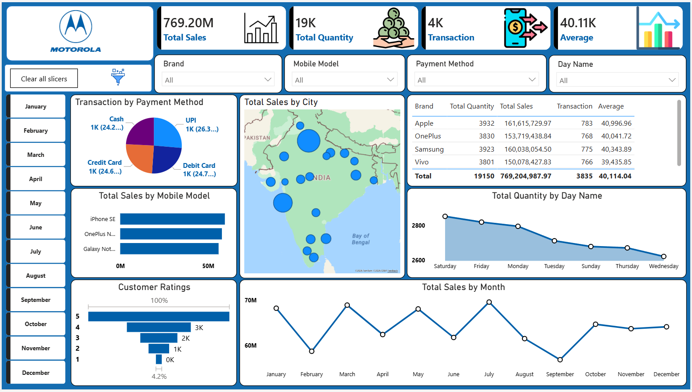

# Motorola Sales Analytics Dashboard
## Project Overview
The Motorola Sales Analytics Dashboard is an interactive Power BI dashboard developed to analyze mobile sales performance, customer purchasing behavior, transaction methods, and regional sales trends across India.
The dashboard provides business insights through dynamic visualizations and KPI tracking, helping stakeholders monitor sales growth, product performance, and customer engagement efficiently.
---
# Dashboard Preview

---
# Key Performance Indicators (KPIs)
| KPI | Value |
|---|---|
| Total Sales | 769.20M |
| Total Quantity Sold | 19K |
| Total Transactions | 4K |
| Average Sales Value | 40.11K |
---
# Dashboard Features
## Sales Analysis
- Tracks total sales revenue across different months
- Monitors sales trends and growth patterns
- Identifies peak-performing months
## Brand Performance
- Compares sales and quantity across mobile brands
- Highlights top-performing brands like Apple, Samsung, and OnePlus
## Payment Method Analysis
- Analyzes customer payment preferences
- Includes UPI, Debit Card, Credit Card, and Cash transactions
## City-wise Sales Distribution
- Visualizes sales distribution geographically across India
- Identifies high-sales cities and regions
## Mobile Model Performance
- Displays top-selling mobile models
- Compares revenue contribution by product
## Customer Ratings Analysis
- Tracks customer satisfaction ratings
- Analyzes rating distribution from 1 to 5 stars
## Quantity Analysis by Day
- Examines customer purchasing trends across weekdays
- Identifies high-traffic sales days
---
# Business Insights
- Apple generated the highest overall sales revenue.
- UPI emerged as one of the most preferred payment methods.
- Sales performance peaked during July and March.
- Most customers provided 5-star ratings, indicating high customer satisfaction.
- Metro cities contributed significantly to total sales revenue.
---
# Tools & Technologies Used
- Power BI
- DAX (Data Analysis Expressions)
- Power Query
- Excel / CSV Dataset
---
# Business Use Cases
- Retail Sales Performance Monitoring
- Mobile Product Sales Analysis
- Customer Purchase Behavior Analysis
- Regional Sales Tracking
- Revenue and Transaction Monitoring
---
# Author
SHAKTHI KUMAR SHARMA
---
# License
This project is licensed under the MIT License.
````
